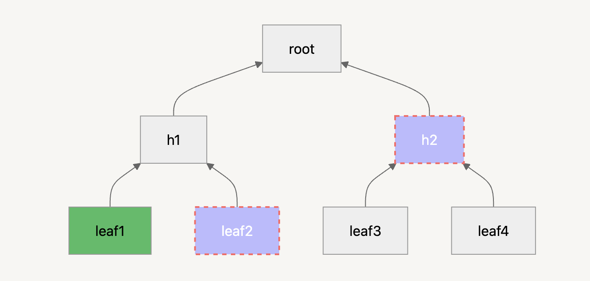
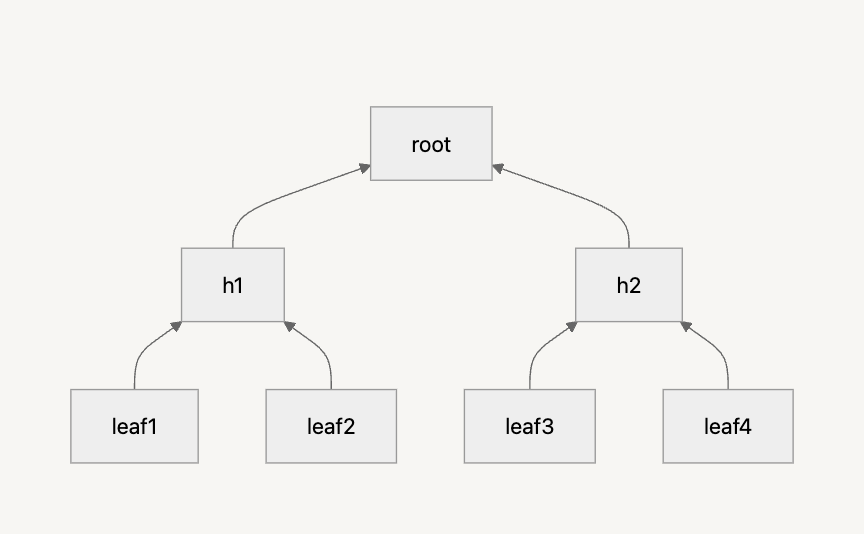
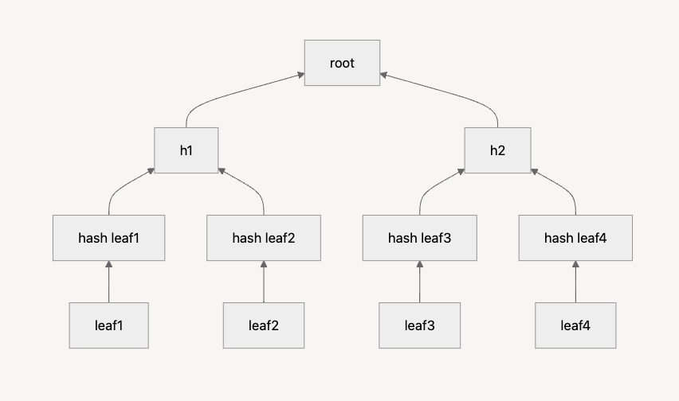

# Halo2 soundness issues

# Introduction

## What is Halo2?

Halo2 is a proving system originally [developed by Zcash](https://github.com/zcash/halo2), built on top of PLONK. More specifically, it extends PLONK into UltraPLONK, introducing support for custom gates and lookup arguments, making it highly flexible for different ZK applications.

### Why use Halo2?

Halo2 offers several key advantages:

- Recursive proofs: Supports advanced proof composition techniques.
- No trusted setup: By default, it uses the IPA (Inner Product Argument) as a polynomial commitment scheme, eliminating the need for a trusted setup. However, the PSE fork of Halo2 introduced KZG commitments, which do require a trusted setup.
- Custom gates & flexible layouts: Unlike rigid proving systems, Halo2 lets developers define custom constraints and optimize circuits for specific use cases, such as elliptic curve operations or cryptographic hash functions.

This flexibility is Halo2’s biggest strength—but also its main challenge. Writing circuits in Halo2 can be more challenging compared to other frameworks due to the requirement of manually managing constraint logic.

### How does it compare to Noir?

More user-friendly alternatives like Noir have emerged, simplifying ZK circuit development with a higher-level abstraction. Noir is designed to be developer-friendly, focusing on ergonomics and ease of use, whereas Halo2 is better suited for low-level optimizations, recursive proofs, and highly customized constraint logic.

That said, Noir still has some limitations compared to Halo2 when it comes to fine-tuning performance and advanced constraint layouts. It’s also worth noting that Noir has a larger beginner-friendly community and more accessible learning resources.

## Soundness in ZK Proofs

In zero-knowledge proofs, soundness ensures that a dishonest prover cannot convince a verifier of a false statement.

In simple terms: you cannot prove something that isn’t true 😊

Building a zero-knowledge proof is a complex process with many layers of abstraction. When we write a circuit, we’re only dealing with the top layer, but under the hood, we rely on:

- The Halo2 compiler to correctly translate our logic.
- UltraPLONK arithmetization to enforce constraints properly.
- Underlying cryptographic assumptions (e.g., elliptic curves, commitment schemes) to remain secure.
- and many other layers in-between…

These layers introduce potential risks—for example, elliptic curve cryptography is currently secure, but long-term threats (such as quantum computing) are why some proof systems are shifting toward quantum-safe alternatives (for example, hash-based and lattice-based).

That said, for now, we’ll assume everything below our circuit is secure and focus purely on soundness within the circuit itself.

### A Practical Example: Soundness in a ZK Sudoku Circuit

Imagine I’m running an elite Sudoku tournament, and players want to prove they’ve solved a Sudoku puzzle without revealing their solution.

To ensure fairness, we design a ZK circuit where a player can submit a proof that their solution is correct, and a verifier checks it without learning the actual numbers.

But what if there’s a bug in the circuit?

A clever participant might find a way to generate a valid proof without actually solving the puzzle. The tournament organizers (and everyone else) would assume they’re a Sudoku genius, when in reality, they just exploited a soundness issue.

This is why soundness is critical: it ensures that only valid solutions can pass verification.

## Completeness

While we’re focusing on soundness issues, it’s worth briefly mentioning completeness, which represents the opposite problem.

Completeness ensures that if a statement is true, it can always be proven. If a circuit has a completeness bug, then a valid proof might incorrectly fail verification.

Going back to our Sudoku example:

- Soundness issue → A player fakes a proof and wins unfairly.
- Completeness issue → A player genuinely solves the puzzle, but the proof incorrectly fails, unfairly disqualifying them.

## Common ZK Circuit Vulnerabilities

Since we’re focusing on soundness (invalid proofs passing verification), let’s go over some common pitfalls in ZK circuits:

- **Incorrect constraints** → The circuit doesn’t fully enforce the intended logic.
- **Unconstrained variables** → An input or intermediate value isn’t properly constrained, allowing unintended values.
- **Range check issues** → The circuit fails to prevent underflows/overflows.
- **Side-channel leakage** → If the circuit leaks unintended information, attackers might extract secrets based on proof generation time or memory access patterns.
- **Improperly constrained lookups** → In lookup-based circuits, missing constraints might let an attacker introduce unauthorized values.

For a deeper dive into real-world ZK circuit vulnerabilities, check out [this repo](https://github.com/0xPARC/zk-bug-tracker) or [this article](https://blog.oxor.io/common-vulnerabilities-in-zk-proof-5ba7620dfa2f)**.**

# Underconstrained circuits

Let’s start working with some circuits!

To make it easier for you to experiment, I’ve prepared some "base" circuits in `src/base`. These serve as simple starting points if you want to play around and get familiar with the concepts.

I’ll typically have multiple versions of each circuit: the first version (the vulnerable one) will be in a file named `circuit0.rs`, and the next, “safer” versions will be in `circuitX.rs`.

## Multiplication: underconstrained

Let’s begin with something simple.

Imagine we’re in a math competition. Contestants don’t have calculators and are given a number `result`. They need to find two numbers, `a` and `b`, such that they multiply to `result`. The goal is for them to generate a proof that can be verified without revealing the solution to other contestants.

Take a look at [`mul/mod.rs`](./src/mul/mod.rs). You’ll notice that the proof is generated correctly, even though the values are incorrect. Why does this happen?

It’s because we forgot to add a constraint on the result (i.e., the public input).

In such a straightforward circuit, the bug is easy to spot. In fact, the compiler even hinted at it when it threw a warning about the unused instance column, which I silenced with `#[allow(dead_code)]`. The compiler was essentially telling me that I forgot to add the necessary constraint. 😄

### mul1: constrain the output

To fix the issue and ensure the result is correct, we need to constrain the instance and make sure it matches the `out` cell:

```rust
layouter.constrain_instance(out.cell(), config.instance, 0)?;
```

Take a look at [`mul1.rs`](./src/mul/mul1.rs)

### mul2: constrain the rows

Now, the circuit is looking better, but it’s still not secure. Why? Because there’s no constraint that forces the `out` cell to equal `a * b`. A malicious actor could simply modify the cell to match the `result`, bypassing the verification.

For instance, in the code:

```rust
let advice = prover.advice_mut(0);
advice[2] = CellValue::Assigned(result);
```

I accessed the advice column and modified the appropriate cell to be equal to the `result`. This bypasses the intended logic.

To fix this in [`mul2.rs`](./src/mul/mul2.rs), I added a gate to enforce the correct multiplication relationship and prevent cheating.

However, even with this fix, the circuit is still not fully secure. Why? Because we haven't constrained the inputs. A cheater could pass `a=1` and `b=result`, and the proof would still be valid. To prevent this, we need to add range checks, and possibly even a constraint to ensure that `a` and `b` are prime numbers greater than 2.

I’ll leave it to you to implement `mul3`, a fully secure version of this circuit.

Let’s move on to another example for now, but we might revisit the multiplication circuit later to further improve it.

## Square root: non-deterministic

We’ve previously seen how an underconstrained circuit can lead to possible cheating by the prover.

Now, let’s explore a concept called a “non-deterministic circuit.” In simple terms, this occurs when multiple valid inputs can lead to the same correct proof. It’s still a variant of being "underconstrained," but with a different twist.

We touched on this in the Multiplication circuits, but it’s worth focusing on more closely here.

Let’s say we want to prove that we know the square root of a number.

For example, if I ask you for the square root of 25, you’ll quickly say 5. But… a clever person could also answer `-5`, and they would be right as well.

Remember: since we're working with finite fields, -5 is actually equivalent to p - 5, where p is the modulus of the field. In [square_root/mod.rs](./src/square_root/mod.rs) (we use 9 and its square root 3 instead of 25 and 5), you can confirm that the variable [fake_root](./src/square_root/mod.rs#L12) is indeed equal to `p - 3`

This is the issue in [`sroot0`](./src/square_root/sroot0.rs): we allow negative numbers (or "really big number" since we're talking about finite fields), which introduces ambiguity.

To fix this, we need to implement a **range check**: [we constrain the input to a defined range.](./src/square_root/sroot1.rs#L51)

You must decide in advance what that range should be. You can’t simply say, “I’ll limit to positive numbers,” because remember—there’s no inherent concept of negative numbers in a finite field.

For example, if your field’s prime is `p`, you could constrain the range to `[0, p/2]`, but that’s still a pretty large range.

In this example, we’ll restrict the input to a smaller range of [1, 10]. This resolves the issue because p is very large, making it impossible that an unintended negative value wraps around in our finite field.  
However, if we were working in $\mathbb{F}_{11}$ this constraint would be ineffective because values would naturally wrap around within a much smaller range.

This highlights an important point: when designing constraints, we must always consider the size of the field and how modular arithmetic interacts with our logic. A constraint that works well in a large prime field might be completely useless in a smaller one!

## Casino: more range checks

I'm a casino owner, and I want to prove that our total revenue this month was less than $1M, without revealing the exact amounts.

In our casino, revenue comes from one source: customer deposits when they buy chips. We don’t account for payouts because let’s be real… the casino never loses. 😏

To protect financial privacy, the IRS has implemented a zero-knowledge system, allowing us to input all deposits and generate a proof verifying that our total revenue stays below $1M, without disclosing individual deposit amounts. This ensures customer anonymity while maintaining transparency.

For the proof to be valid, every deposit must be accounted for:

- No transaction can be erased or modified.
- The proof must reflect the exact total of all deposits.
- Amounts cannot be negative.

This guarantees that the casino cannot manipulate the numbers, while still keeping deposit details confidential.

But… what if there’s still a flaw? 🤔

In [`casino0.rs`](./src/casino/casino0.rs), we avoided the same mistake made in [`mul0`](./src/mul/mul0.rs): here, the public output is correctly constrained.

In the `synthesize()` function, we loop over the input “deposits” and assign values to the cells in the advice column (column 0). We also compute the total sum and assign it to the last row of the advice column.

However, we forgot to correctly constrain the rows in between, which is where things start to get tricky. This example is a bit more complex than the `mul` example. To handle this, we introduce another column to output the running sum of the first column. It looks like this:

| col 1 (”deposits”) | col 2 (”sum”)     |
| ------------------ | ----------------- |
| a                  | a                 |
| b                  | a + b             |
| c                  | a + b + c         |
| …                  | a + b + c + …     |
| j                  | a + b + c + … + j |

In [`casino1.rs`](./src/casino/casino1.rs), you’ll see how we use this second column, and the “running sum” gate enforces the necessary constraints. We also introduce a “first row” gate to ensure the sum starts at zero. No cheating allowed!

But we face another issue: we could add a fake value that causes an overflow, which would be equivalent to adding a negative value. Let me explain:

Suppose we have three deposits: 5, 10, and 20, and we’re working in the field $\mathbb{F}_{101}$. The current sum is 5 + 10 + 20 = 35. However, if I add a fake value of 80, the new total will be:

(5 + 10 + 20 + 80) % 101 = 14 😱

This is a problem! To prevent this, we need **range checks**: we need to make sure each deposit is less than a certain value, say X.

In this case, we use a simple solution by constraining values to be within the range of 1 to 1000, utilizing a lookup table for the check.

For higher numbers, we can decompose the value into bytes and range-check each byte individually.

You can see how I’ve implemented this in [`casino/mod.rs`](./src/casino/mod.rs) and added the lookup table to [`casino2.rs`](./src/casino/casino2.rs). Notice that we now need at least 1000 rows in our table, so `K` must be at least 10 ($2^K > 1000$).

Note that if the number of transactions is extremely large, p could still overflow, causing unintended behavior. In real-world conditions, a safeguard should be added to ensure that the number of transactions remains below a safe threshold. A reasonable check would be to enforce that the number of transactions is smaller than $\frac{p}{1000}$, reducing the risk of overflow while maintaining efficiency.

## Merkle NoHash Circuit

Let’s take things up a notch and build a more complex circuit.

Merkle trees are one of the most common and powerful data structures in cryptography, so why not make a circuit for it?

The structure of our Merkle tree circuit is straightforward: we have a known root hash, which is passed as a public input, and the user must prove that they know a leaf contained within the tree.


You can see in the image that the goal is to prove the inclusion of "leaf1" in the Merkle tree. To do this, we provide "leaf2" and "h2" as neighbor values, which are used step by step to recompute the intermediate hashes up to the root. This ensures that "leaf1" is indeed part of the tree without revealing the entire structure.

But let’s add a little _twist_ to our Merkle circuit to simplify things. 😁

In a traditional Merkle tree, each node is derived by hashing its two child nodes together:

$$
hash(a,b)=hash(a||b)
$$

Instead of using a cryptographic hash function, we’ll take a shortcut and simply add the values together:

```
hash(a, b) = a + b
hash(a) = a + a
```

Among other things, this Merkle tree lacks collision resistance. Notice that hash(3, 7) == hash(4, 6), meaning two different pairs of values produce the same hash. This could allow an attacker to manipulate the tree by swapping values while maintaining a valid proof. In a secure design, the hash function should ensure that different inputs always produce distinct outputs.

This makes it easier to experiment with constraints and understand the underlying logic, hence the name _Merkle NoHash_ circuit! 😁

At the end of this tutorial, we’ll swap our addition-based approach for Poseidon, allowing you to test a proper Merkle tree implementation, with a secure hash function. Stay tuned! 😊

### [Version 0](./src/merkle/merkle_nohash0.rs)

Let’s jump straight into building what _seems_ like a correctly constrained circuit. But… is it really? 🤔

Let’s break it down.

We’ll use [three advice columns](./src/merkle/merkle_nohash0.rs#L16):

- **Column 1** stores the left leaf.
- **Column 2** stores the right leaf.
- **Column 3** is used alternately to store the swap bit and the computed hash.

Each layer of the tree spans two rows:

1. The **first row** holds the left and right leaves (which may be in any order).
2. The **second row** reorders them based on the swap bit and stores the resulting hash in the third column.

For example, given the leaves **[2, 5, 11, 20]**, the advice columns are populated as follows:

| Advice[0] | Advice[1] | Advice[2] |
| --------- | --------- | --------- |
| 2         |           |           |
| 2         | 5         | 0         |
| 2         | 5         | 7         |
| 7         | 31        | 0         |
| 7         | 31        | 38        |

At first glance, everything _looks_ secure. But there’s a critical mistake: we forgot to constrain the root hash to match the public input.

The root of the tree is supposed to be passed as a public input so it can be independently verified, say, by a smart contract. However, we’ve left the circuit vulnerable.

By now, you might realize another major issue: even if we _do_ constrain the computed root hash to match the public input, a prover could still modify intermediate values in the tree.

Clearly, we need stronger constraints. Time to fix it in Version 1! 🚀

### [Version 1](./src/merkle/merkle_nohash1.rs)

Now, we’ve [constrained the root](./src/merkle/merkle_nohash1.rs#L114) and added a gate to ensure the [hash is computed correctly](./src/merkle/merkle_nohash1.rs#L76). Our Merkle tree should be secure… right?

Not so fast. 🚨

There’s still a major flaw:

A prover could bypass the checks by passing empty elements and simply [providing the known root as a leaf](./src/merkle/mod.rs#L72).

Wow. Such an easy vulnerability. 😬

Time to fix it!

### [Version 2](./src/merkle/merkle_nohash2.rs)

To patch this, we ensure that [at least one valid layer of the tree is present in the advice columns](./src/merkle/merkle_nohash2.rs#L103). This prevents users from skipping the hashing process entirely.

Great! Our proof is getting stronger… but we still have a problem.

Right now, the leaf itself is not hashed, meaning a prover could [provide the last layer as input](./src/merkle/mod.rs#L92) and still compute a valid root.

Let’s break it down with a visual example:



Here’s the issue: if you already know `h1` and `h2`, you can just pass `h1` as the "leaf" and `h2` as its neighbor—skipping the lower layers entirely.

That means you could fake a proof without actually proving knowledge of an original leaf. 😱

**The Fix:**

To prevent this, the leaf must first be hashed within the circuit before computing the tree.

Here’s what it should look like:



Now, even if a prover tries to skip layers, they can’t cheat, the circuit forces them to start from an original leaf and hash their way up.

No more shortcuts. ✅

But… can we still break it? 🤔

Let’s find out in Version 3! 🚀

### [Version 3](./src/merkle/merkle_nohash3.rs)

Now, we [hash the leaf first before constructing the tree](./src/merkle/merkle_nohash3.rs#L99). This should prevent cheating… right?

Not quite. We run into another issue—our initial leaf hash isn’t constrained.

That means a prover can still bypass the entire hashing process by [providing a fake leaf](./src/merkle/mod.rs#L125). We’re back to our previous vulnerability:

🚨 The prover can simply pass `h1` as a "leaf" and `h2` as a neighbor, skipping the actual hashing.

**Breaking it down:**

Let’s say we’re using a random leaf value of 15. The prover replaces it with `h1`'s value.

Meanwhile, `h2`’s value is 62 (computed as `(11+11) + (20+20)`).

Here’s what the advice columns look like:

| Advice[0] | Advice[1] | Advice[2] |
| --------- | --------- | --------- |
| 15        |           | 30        |
| 30        | 62        | 0         |
| 30        | 62        | 92        |

The current constraints are:

- `advice[2][0] == advice[0][1]`
- `advice[0][2] + advice[1][2] == advice[2][2]`

So, what’s the hack? We modify the advice columns while ensuring these constraints remain valid.

We insert `h1`'s correct value (14) and the root hash. No need to modify the original leaf value.

Our table now looks like this:

| Advice[0] | Advice[1] | Advice[2] |
| --------- | --------- | --------- |
| 7         |           | 14        |
| 14        | 62        | 0         |
| 14        | 62        | 76        |

### [Version 4: the masterpiece](./src/merkle/merkle_nohash4.rs)

Finally, we arrive at **Version 4**—the **secure** version of our Merkle tree circuit! 🎉

We’ve now correctly:

✅ Constrained all layers

✅ Enforced the correct root hash

✅ Prevented any shortcut tricks

This version should be **bulletproof**… or is it? 😏
